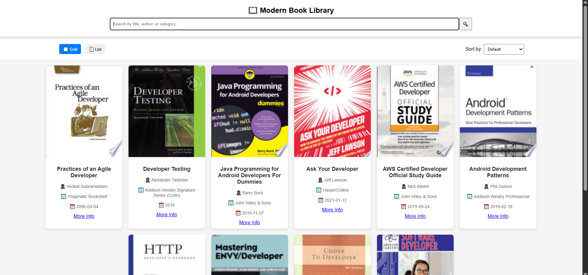

    # 📝 Markdown Previewer

A **real-time Markdown Previewer** that instantly converts Markdown syntax into a live HTML preview. This tool is designed to enhance productivity by providing instant feedback while writing Markdown.

## 🚀 Features  
✅ **Live Markdown Preview** – See real-time updates as you type  
✅ **Supports Standard Markdown Syntax** – Headings, Lists, Code, Links, etc.  
✅ **Auto Updates** – No need to refresh, updates automatically  
✅ **Minimalist & Responsive UI** – Clean interface with optimized performance  

## 📸 Screenshots  
  

## 🌍 Live Demo  
🔗 **[Try the Live Version](https://masterji-js-assignments.netlify.app/js5.html)**  

## 🛠️ Installation & Setup  
Follow these steps to run the project locally:  

### **1️⃣ Clone the Repository**  
```sh
git clone https://github.com/Hariom5266/CODE-CACHORI-COHORT.git
```

### **2️⃣ Navigate to the Project Folder**  
```sh
cd assignments/JS-MASTERJI-ASSIGNMENT/js4
```

### **3️⃣ Open the Project in a Browser**  
Simply open the `index.html` file in any modern web browser.  

---

## 🏗️ Tech Stack  
🔹 **HTML5** – Structure & Markup  
🔹 **CSS3** – Styling & Layout  
🔹 **JavaScript (Vanilla JS)** – Functionality & Real-time Preview  
🔹 **Marked.js** – Markdown Parsing & Rendering  
---

## 👨‍💻 Author  
Developed with ❤️ by **[HC Joshi]**  
📧 **Email:** hariextra3366@gmail.com 

---

### 🌟 **If you find this project useful, consider giving it a star ⭐ on GitHub!**  


